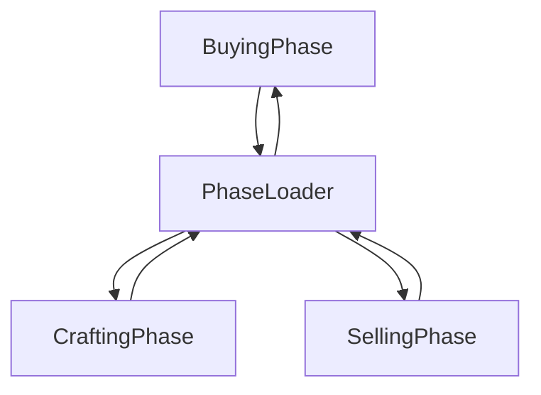

# AI Shopping Game

## GAME-ENGINE
The game is separated into two main folders, the game engine created by João Neto using the pygame library, and the actual game folder created using GameObjects.

The game must be run through main.py

## GAME FLOW
- The game flow is composed of 3 phases (BuyingPhase, CraftingPhase, SellingPhase), a PhaseLoader and a PhaseController.
- The PhaseController is the one that actually manages the game flow, while the PhaseLoader is only an intermediate phase where the player must interact with the RegisterBook, pressing the E key to begin the next phase

PhaseLoader:

# BUYING PHASE
- The explanation is simple: if the player has enough money, the purchased amount is added to the item in the player's resource inventory.

## CRAFTING PHASE
- The crafting phase allows the player to craft items from recipes, each craft having a success rate. The player's attempt value is calculated based on their level * a random number from 1 to 6.
- If the craft fails, the items are consumed anyway. If successful, the player gains more experience.
- Craft() is a method belonging to the Recipe GameObject that works as follows:
  - checks if there is enough of all required resources; if not, just returns
  - reduces the amount of the required resource in the player's inventory
  - if the player's attempt fails, those resources are consumed anyway, but the crafted output item is not generated
  - adds the crafted item to the inventory

## SELLING PHASE
This phase works in a more complex way because it generates a demand subsystem for the products the player can sell, altering the prices buyers are willing to pay.

### Demand System
- Generates a list with a Demand enum value for each item the player can sell
- Demand can be Demand.Low, Demand.Normal, or Demand.High
- In each Selling Phase, a new wave of demand is randomly generated
- Demand.Low: NPCs pay between 1/3 and 1/5 LESS
- Demand.Normal: NPCs pay the base value
- Demand.High: NPCs pay between 1/3 and 1/5 MORE

### Rest of the SellingPhase
After generating demands, a random number of NPCs is spawned. When the player enters their interaction rectangles, if they have the desired item, they can sell it by pressing E.

NPCs make offers according to the demand system, and their positions are generated randomly from a predefined list, ensuring no overlap.  
The number of NPCs ranges from 5 to 8.

## VICTORY CONDITION
When the player reaches 1000 coins, they win the game.  
(pro-tip: pressing M gives 100 coins — debugging)

